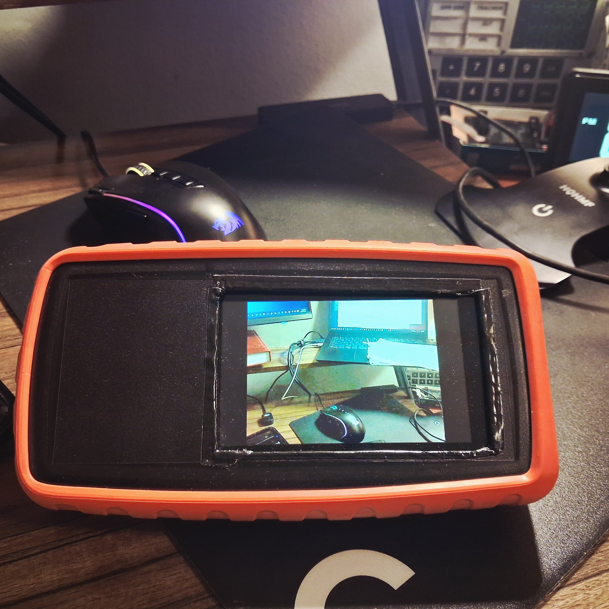
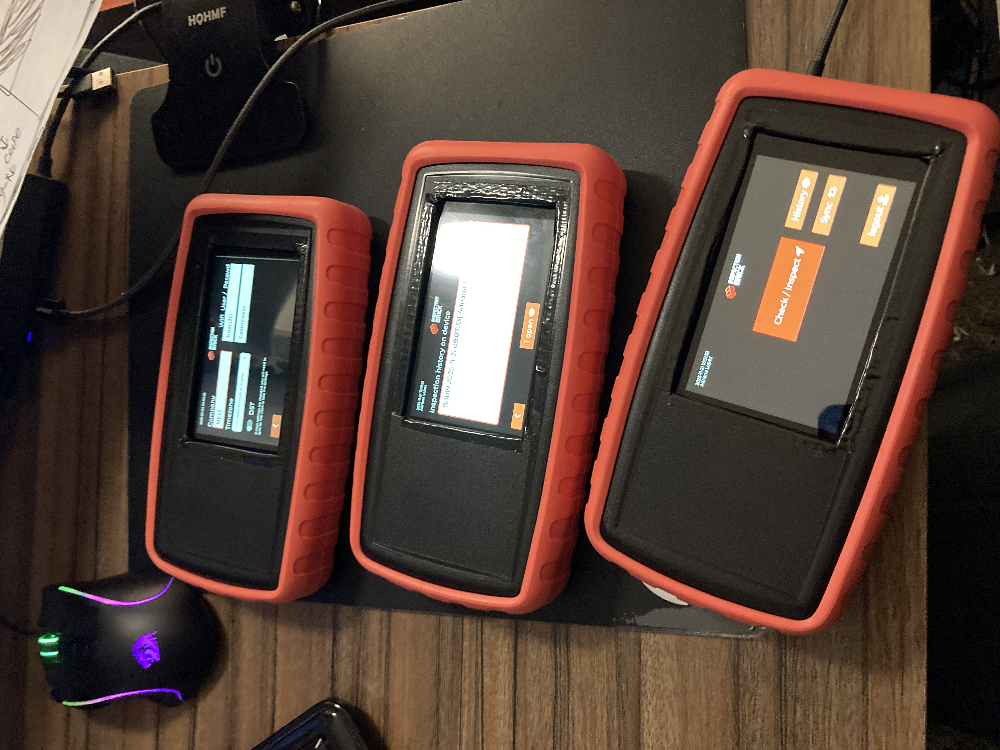
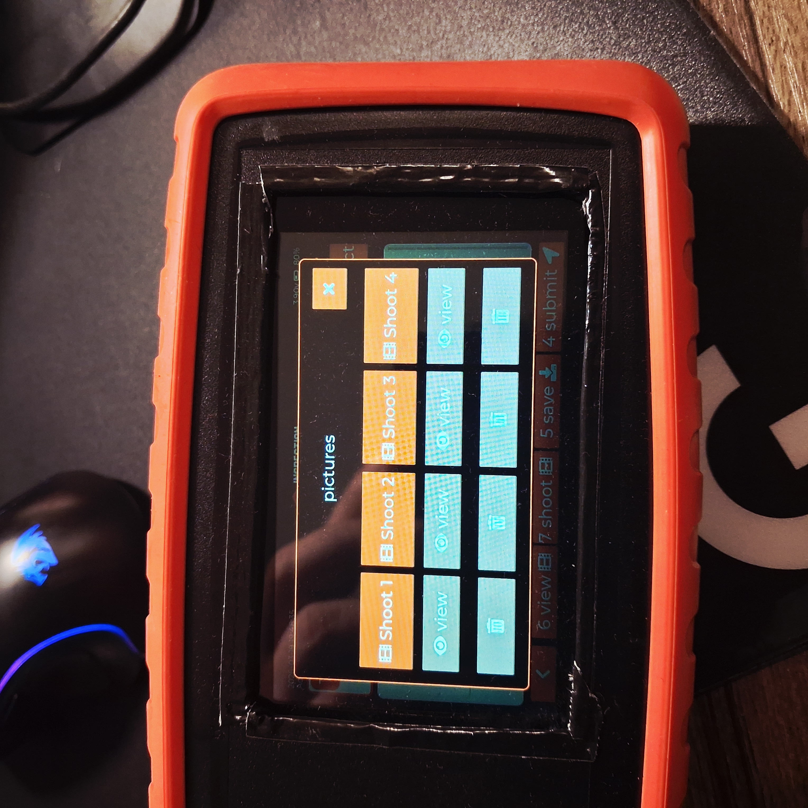
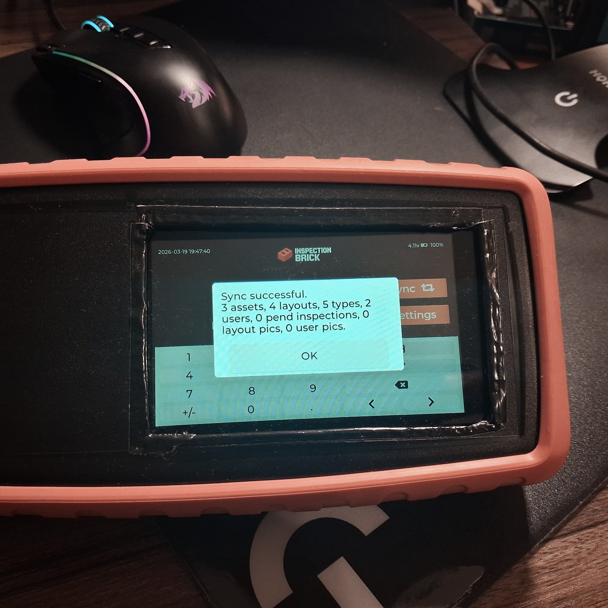
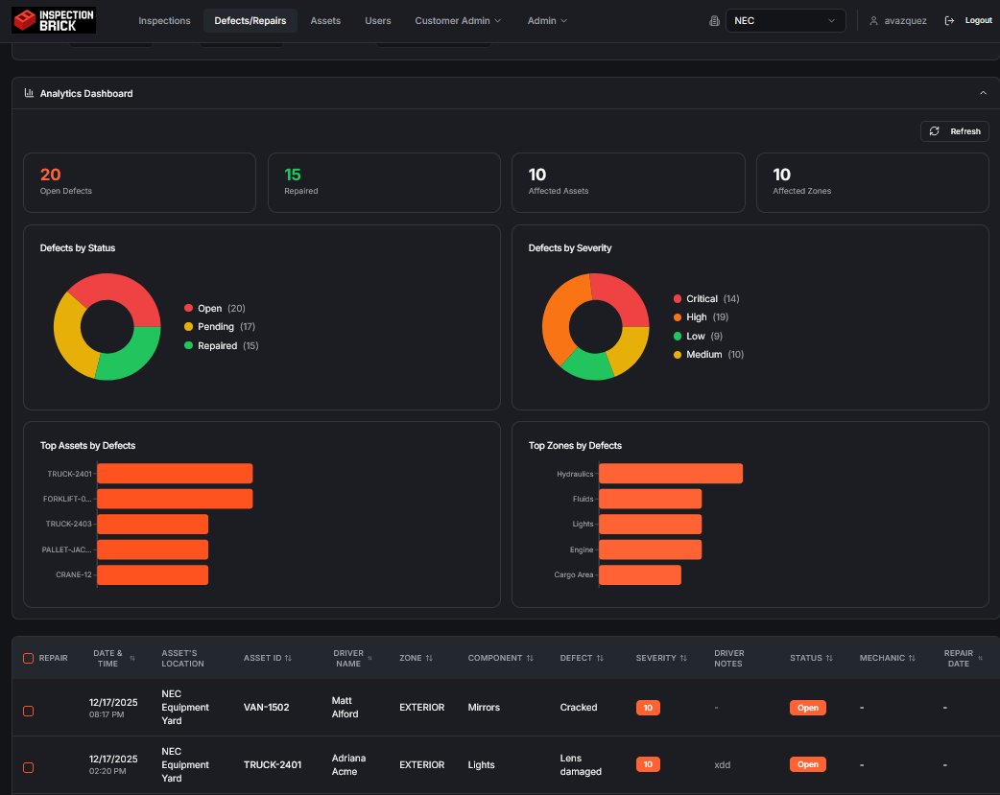
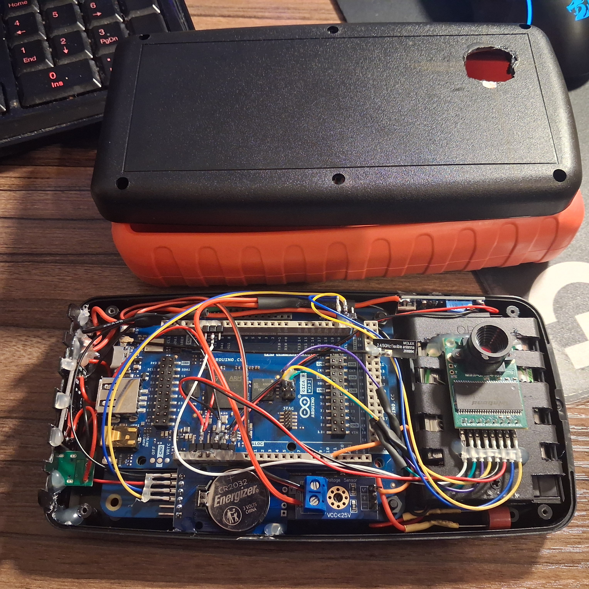
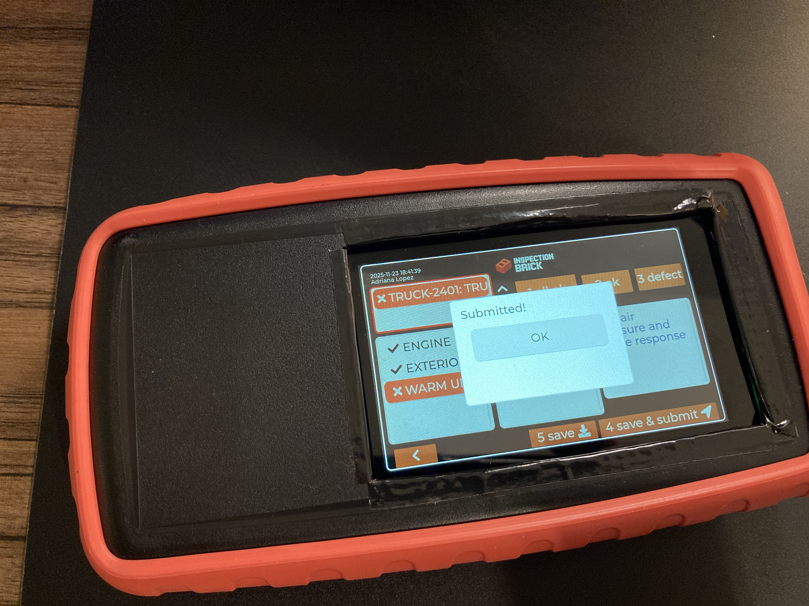
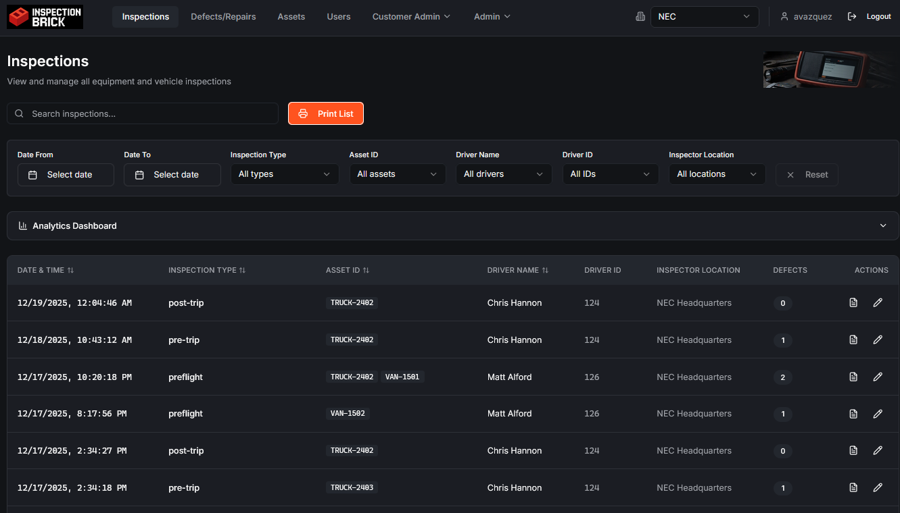
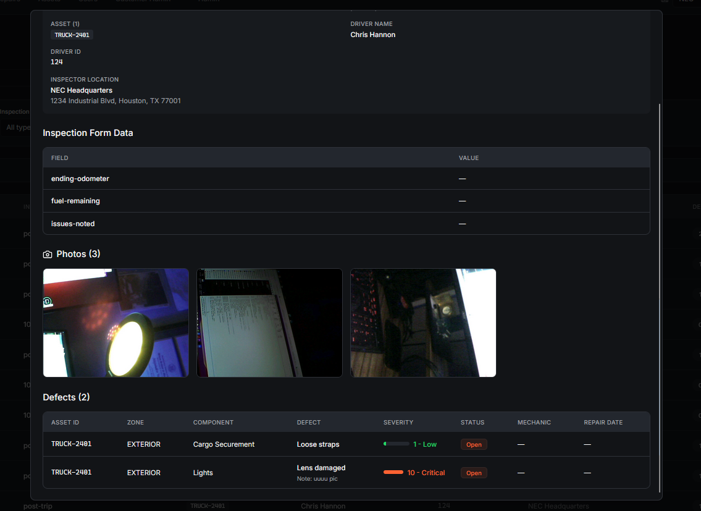

# Brick — Embedded Inspection Device  
**Apache 2.0 License**

> Rugged, low-cost, cloud-connected inspection platform  
> Designed and built end-to-end (hardware + firmware + UI + backend)

**Author:** Alejandro Vazquez  
**Platform:** Arduino GIGA R1 WiFi (STM32H747XI)  

---

## 🚀 What is Brick?

Brick is a **handheld industrial inspection device** designed to replace paper forms and expensive legacy systems with a **low-cost, modern, connected solution**.

It enables field operators to:
- Perform structured inspections
- Capture images directly on device
- Track assets and defects
- Sync data securely to the cloud

---

## 📸 Device Overview

- Rugged enclosure (Serpac H75 + protective sleeve)
- Touchscreen interface
- Battery-powered operation
- Integrated camera
- USB charging + debug interface

---

## 🧠 Why Brick Exists

Legacy inspection systems are:
- Expensive ($2K–$5K per unit)
- Slow and outdated
- Difficult to customize
- Often disconnected from modern cloud workflows

**Brick solves this by:**
- Using modern embedded hardware (Arduino GIGA / STM32)
- Providing a responsive UI (LVGL)
- Enabling real-time cloud sync
- Being modular and extensible

---

## 🎯 Core Capabilities

### ✔️ On-Device Inspection Flow

- Guided inspection workflow
- Zone/component/defect tracking
- Pass/fail logic
- Save & submit flow

---

### 📷 Image Capture & Management

- Multi-shot capture per inspection
- On-device preview
- Save / delete / review images
- JPEG handling on embedded system

---

### 🔄 Cloud Sync

- Secure data synchronization
- Assets, layouts, users, inspections
- Offline-first → sync when available

---

### 📊 Backend & Analytics

- Inspection tracking
- Defect analytics
- Asset-level insights
- Repair workflow integration

---

## 🛠 Hardware Architecture

**Core Components:**
- Arduino GIGA R1 WiFi (STM32H747 dual-core)
- ArduCam Mini (SPI, onboard compression)
- TFT Display (Arduino_H7_Video)
- RFID (MFRC522)
- RTC + battery backup
- Custom power system (NiMH + boost)

**Design Goals:**
- Minimal wiring complexity
- Stable signal integrity (SPI over DVP)
- Field-serviceable
- Low-cost scalable BOM

---

## 🔌 Device I/O & Power

- USB power + programming
- Battery operation
- Status LEDs
- Expansion capability

---

## 🧩 Software Architecture

- **UI:** LVGL 8.3 (custom widgets, navigation, layout system)
- **Display Driver:** Arduino_H7_Video
- **Storage:**
  - SDRAM (frame buffers, UI heap)
  - QSPI (images, persistence)
- **Camera:** SPI + JPEG decode pipeline
- **Communication:**
  - HTTPS / SSL
  - REST-based sync
- **Patterns:**
  - Deterministic startup sequence
  - Memory pool management (no fragmentation issues)
  - Event-driven UI

---

## ⚡ Key Engineering Achievements

- Stable LVGL UI on STM32 dual-core
- JPEG image pipeline on embedded device
- Reliable SPI camera with long cable (noise mitigation)
- Flash block storage (QSPI)
- Secure HTTPS communication from embedded device
- Fast, deterministic boot (no race conditions)
- Modular inspection schema (assets, layouts, defects)

---

## 🖥 Full System View

Brick is not just a device — it’s a **complete system**:
- Embedded device
- Cloud backend
- Web UI for analytics and management

---

## 🚧 Development Approach

- “New Jersey style” engineering:
  - Keep it simple
  - Avoid over-engineering
  - Solve real problems first
- No premature optimization
- End-to-end ownership (hardware → firmware → backend)

---

