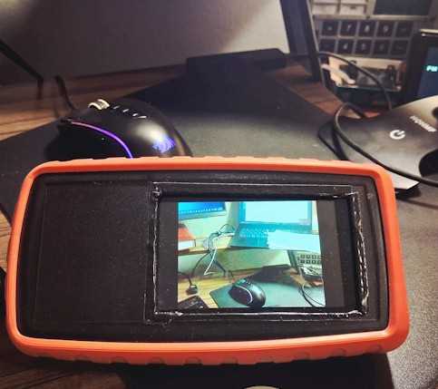
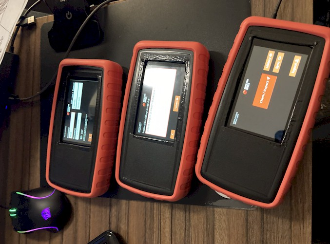
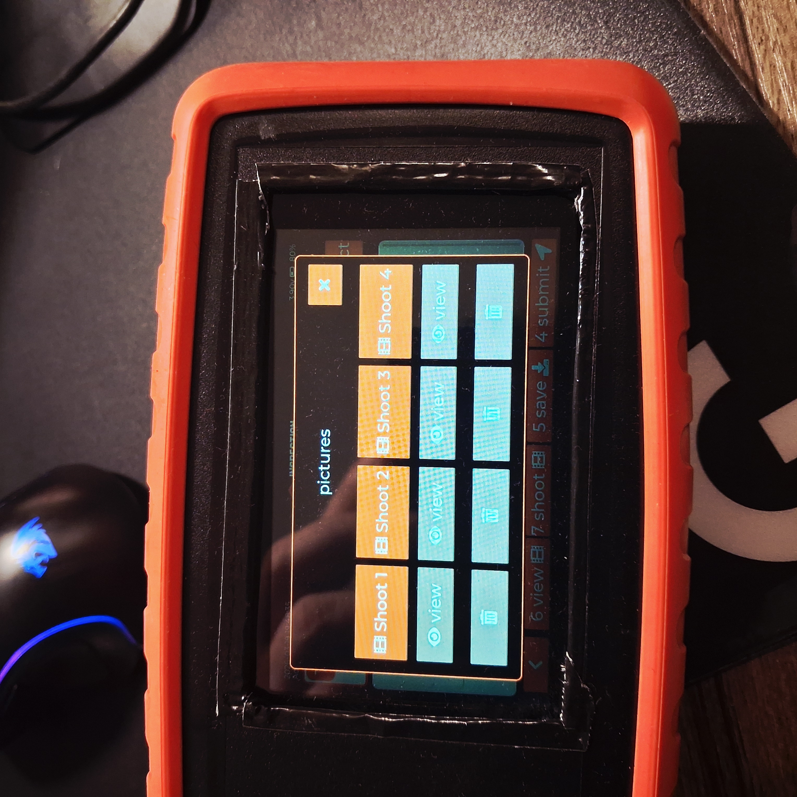
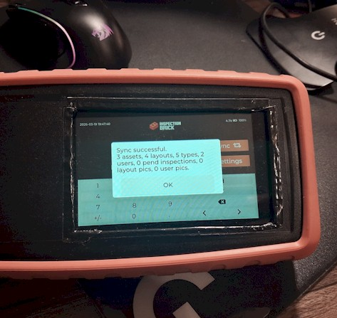
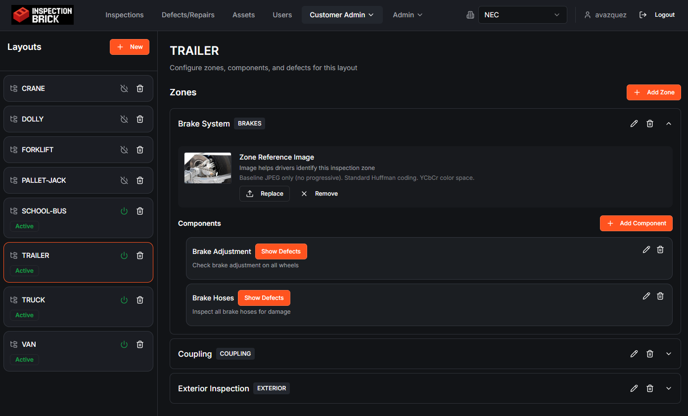
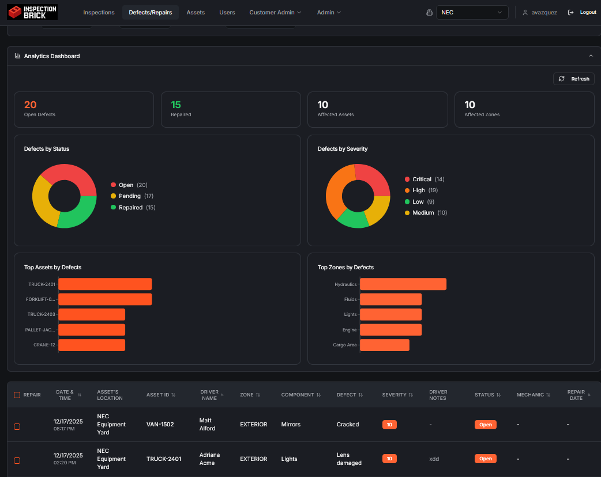
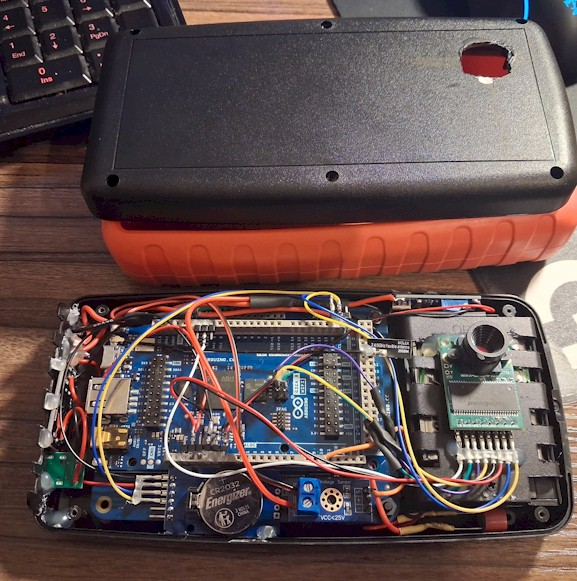
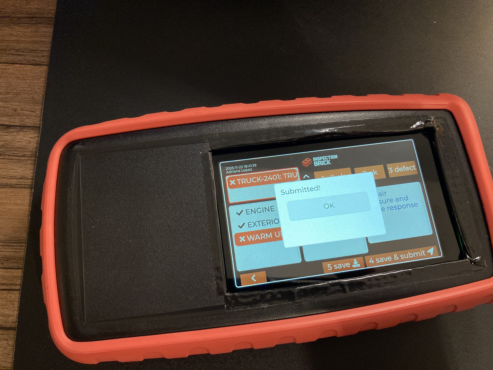
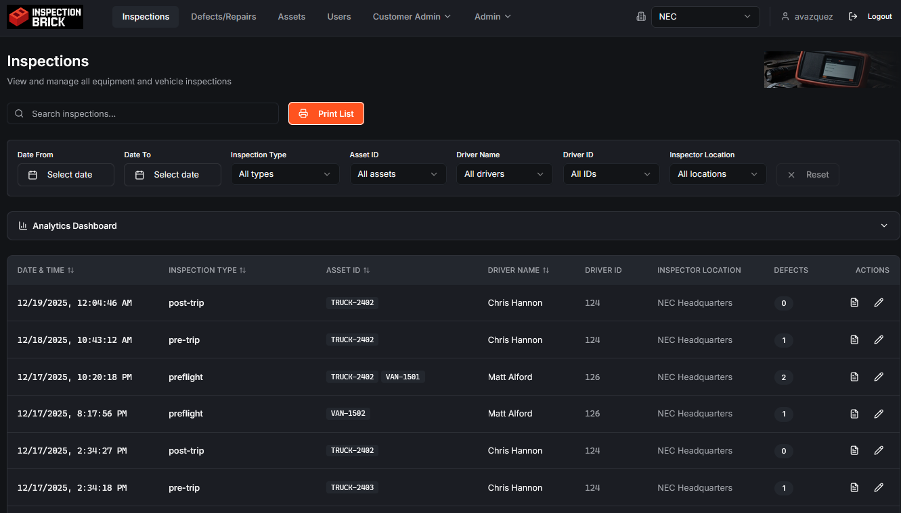
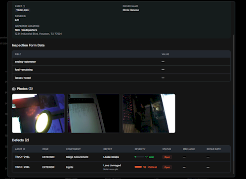

# Brick — Embedded Inspection Device  
**Apache 2.0 License**

> Rugged, low-cost, cloud-connected inspection platform  
> Designed and built end-to-end (hardware + firmware + UI + backend)

**Author:** Alejandro Vazquez  
**Platform:** Arduino GIGA R1 WiFi (STM32H747XI)  

---

## 🚀 What is Brick?

Brick is a **handheld industrial inspection device** designed to replace paper forms and expensive legacy systems with a **low-cost, modern, connected solution**.

It enables field operators to:
- Perform structured inspections
- Capture images directly on device
- Track assets and defects
- Sync data securely to the cloud

---

## 📸 Device Overview



- Rugged enclosure (Serpac H75 + protective sleeve)
- Touchscreen interface
- Battery-powered operation
- Integrated camera
- USB charging + debug interface

---

## 🧠 Why Brick Exists

Legacy inspection systems are:
- Expensive ($2K–$5K per unit)
- Slow and outdated
- Difficult to customize
- Often disconnected from modern cloud workflows

**Brick solves this by:**
- Using modern embedded hardware (Arduino GIGA / STM32)
- Providing a responsive UI (LVGL)
- Enabling real-time cloud sync
- Being modular and extensible

---

## 🎯 Core Capabilities

### ✔️ On-Device Inspection Flow



- Guided inspection workflow
- Zone/component/defect tracking
- Pass/fail logic
- Save & submit flow

---

### 📷 Image Capture & Management



- Multi-shot capture per inspection
- On-device preview
- Save / delete / review images
- JPEG handling on embedded system

---

### 🔄 Cloud Sync



- Secure data synchronization
- Assets, layouts, users, inspections
- Offline-first → sync when available

---

### Configurable Inspection Layouts

One of the most important parts of the system is the Layout Builder — the tool that controls exactly what gets inspected on every asset type.

Supervisors build inspection layouts in the web app, and those layouts are automatically delivered to devices on their next sync. No firmware updates, no manual configuration on the device — just build the layout in the browser, activate it, and it's live.



*The Layout Builder for the TRAILER layout. The left panel lists all configured layouts — active ones (SCHOOL-BUS, TRAILER, TRUCK, VAN) show a green power icon; inactive ones are grayed out. The right panel shows the zone editor for the selected layout. Here, the "Brake System" zone is expanded, showing a reference photo (used to help drivers identify the area on the vehicle), two components (Brake Adjustment and Brake Hoses), and an "Add Component" button. Additional zones — Coupling and Exterior Inspection — are visible below and can be expanded independently.*

#### How Layouts Are Structured

Layouts follow a strict hierarchy, each level configurable from the web app:

```
Layout  (e.g., "TRAILER")
└── Zone  (e.g., "Brake System", "Coupling", "Exterior Inspection")
    ├── Zone Reference Image  (optional JPEG shown on device during inspection)
    └── Component  (e.g., "Brake Adjustment", "Brake Hoses")
        └── Defect  (e.g., "Out of adjustment", "Cracked", "Leaking")
            └── Severity  (0 = pass/no defect, 1–10 = defect severity)
```

- **Zones** represent major inspection areas of an asset. Each zone can have an optional reference image (a photo of that area on the vehicle) so drivers know exactly what to inspect.
- **Components** are the specific parts within a zone that get checked.
- **Defects** are the named failure conditions for each component, each with a severity rating.
- A severity of **0** is a pass (recorded for audit trail). Severities **1–10** are actual defects that generate repair work orders.

#### Activation and Sync

Layouts must be explicitly **activated** before they are sent to devices. Activation validates that the layout is complete — every zone has at least one component, every component has at least one defect, and all names are filled in. Only active layouts appear in the device's inspection menu after the next sync.

When a device syncs, it receives the full configuration for all active layouts assigned to its company, along with the roster of assets, users, and inspection types. The device stores this locally so inspections can be conducted offline.


---

### 📊 Backend & Analytics



- Inspection tracking
- Defect analytics
- Asset-level insights
- Repair workflow integration

---

## 🛠 Hardware Architecture



**Core Components:**
- Arduino GIGA R1 WiFi (STM32H747 dual-core)
- ArduCam Mini (SPI, onboard compression)
- TFT Display (Arduino_H7_Video)
- RFID (MFRC522)
- RTC + battery backup
- Custom power system (NiMH + boost)

**Design Goals:**
- Minimal wiring complexity
- Stable signal integrity (SPI over DVP)
- Field-serviceable
- Low-cost scalable BOM

---

## 🔌 Device I/O & Power



- USB power + programming
- Battery operation
- Status LEDs
- Expansion capability

---

## 🧩 Software Architecture

- **UI:** LVGL 8.3 (custom widgets, navigation, layout system)
- **Display Driver:** Arduino_H7_Video
- **Storage:**
  - SDRAM (frame buffers, UI heap)
  - QSPI (images, persistence)
- **Camera:** SPI + JPEG decode pipeline
- **Communication:**
  - HTTPS / SSL
  - REST-based sync
- **Patterns:**
  - Deterministic startup sequence
  - Memory pool management (no fragmentation issues)
  - Event-driven UI

---

## ⚡ Key Engineering Achievements

- Stable LVGL UI on STM32 dual-core
- JPEG image pipeline on embedded device
- Reliable SPI camera with long cable (noise mitigation)
- Flash block storage (QSPI)
- Secure HTTPS communication from embedded device
- Fast, deterministic boot (no race conditions)
- Modular inspection schema (assets, layouts, defects)

---

## 🖥 Full System View





Brick is not just a device — it’s a **complete system**:
- Embedded device
- Cloud backend
- Web UI for analytics and management

---

## 🚧 Development Approach

- “New Jersey style” engineering:
  - Keep it simple
  - Avoid over-engineering
  - Solve real problems first
- No premature optimization
- End-to-end ownership (hardware → firmware → backend)

---

